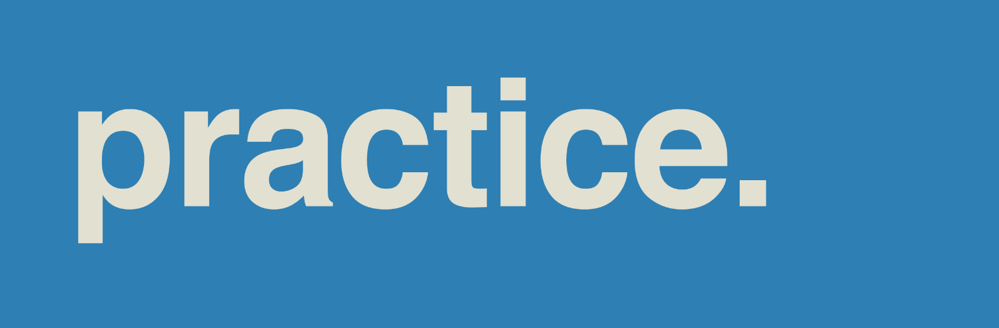

# Practice

This repo contains various code practicing activities I enjoy doing.

## Directory Structure

    .
    ├── codeacademy-learn-go                # Course: Codecademy - Learn Go
    ├── codeacademy-learn-python-3          # Course: Codecademy - Learn Python 3
    ├── conference-devoxx-ukraine-2023      # Conference: Devoxx Ukraine 2023 - 22 September
    ├── conference-spring-io-2023           # Conference: Spring I/O 2023 - 18-19 May
    ├── freecodecamp-responsive-web-design  # Course: freeCodeCamp - Responsive Web Design
    ├── learning-ml                         # Learning: Machine Learning
    ├── learning-nodejs                     # Learning: NodeJS
    ├── learning-python                     # Learning: Python
    ├── practice-algorithms                 # Practice: Algorithms
    ├── practice-hackerrank                 # Practice: HackerRank
    ├── practice-leetcode                   # Practice: LeetCode
    ├── sample-gof-design-patterns-in-java  # Sample: GOF Design Patterns in Java
    ├── sample-java-17-features             # Sample: Java 17 Features
    ├── sample-java-concurrency             # Sample: Java Concurrency
    ├── sample-java-security                # Sample: Java Security
    ├── sample-quickfixj                    # Sample: QuickFIX/J
    ├── sample-spring-graphql               # Sample: Spring GraphQL
    └── sample-tour-of-heros                # Sample: Tour of Heroes

## Profiles

* [HackerRank](https://www.hackerrank.com/popcristianvlad)
* [LeetCode](https://leetcode.com/popcristianvlad/)
* [StackShare](https://stackshare.io/popcristianvlad/)
* [WakaTime](https://wakatime.com/@popcristianvlad)
* [GitHub Gist](https://gist.github.com/popcristianvlad)
* [Codeacademy](https://www.codecademy.com/profiles/popcristianvlad)
* [freeCodeCamp](https://www.freecodecamp.org/popcristianvlad)

## Courses

* [Codecademy - Learn Go](https://www.codecademy.com/learn/learn-go)
* [Codecademy - Learn Python 3](https://www.codecademy.com/learn/learn-python-3)
* [freeCodeCamp - Responsive Web Design](https://www.freecodecamp.org/learn/responsive-web-design/)